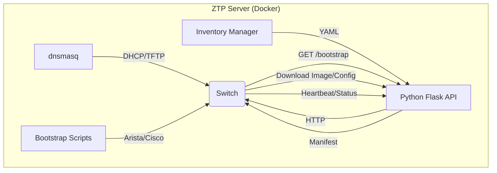

# Multi-Vendor ZTP Server

A lightweight, Dockerized Zero Touch Provisioning (ZTP) server designed for Arista (EOS) and Cisco (IOS-XE) switches. This server automates the deployment process by serving firmware and configurations based on device serial numbers and provisioning priorities.

## Features

- **Multi-Vendor Support**: Unified bootstrap mechanism for Arista and Cisco devices.
- **Priority-Based Provisioning**: Control the order in which switches are provisioned (e.g., core switches first, then edge).
- **Parallel Deployment**: Switches within the same priority level are provisioned simultaneously.
- **Live Progress Dashboard**: Real-time monitoring of the ZTP process directly from your terminal.
- **Dynamic Inventory**: Hot-reload inventory changes without restarting the server.
- **Air-Gapped Ready**: Completely self-contained, serving all necessary files locally.

## High-Level Architecture



## Quick Start

1.  **Clone the repository**:
    ```bash
    git clone <repository-url>
    cd arista-ztp
    ```

2.  **Configure Inventory**:
    Copy the template and add your switch serial numbers.
    ```bash
    cp config/inventory.yaml.template config/inventory.yaml
    ```

3.  **Add Firmware & Configs**:
    Place your firmware images in `firmware/` and configuration files in `configs/`.

4.  **Launch the Server**:
    ```bash
    chmod +x start.sh
    ./start.sh start
    ```

5.  **Monitor Progress**:
    ```bash
    ./start.sh watch
    ```

## Management Commands

The `./start.sh` script is the primary interface for managing the ZTP server:

-   `./start.sh start`: Start the server (builds image if needed).
-   `./start.sh restart`: Full rebuild and restart.
-   `./start.sh status`: Show container and service health.
-   `./start.sh logs`: Follow container logs.
-   `./start.sh reload`: Hot-reload inventory changes.
-   `./start.sh switches`: List registered switches.
-   `./start.sh watch`: Live progress dashboard.

For more details on deployment and advanced configuration, see [deploy.md](deploy.md).
